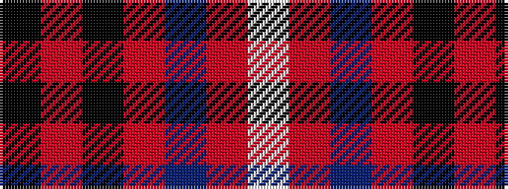

KRKRBRW

It is a 7 stripe tartan.

<figure class="pat-woven">

<figcaption>idealised sample</figcaption>
</figure>

## Colour Sequence



## Tartans with this colour sequence

| Tartans |
|---------------|
| [Cunningham](/setts/s7/k3r1k30r28db1r1lb3~x2/)|
||
| [Cunningham #3](/setts/s7/k3r1k30r28db1r1w3~x2/)|
||
