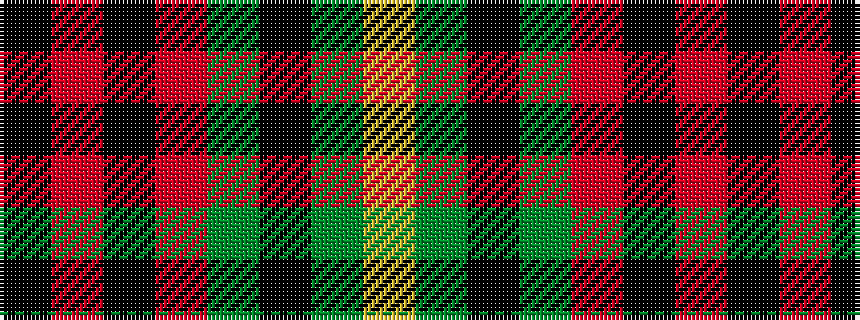

KRKRGKGY

It is a 8 stripe tartan.

<figure class="pat-woven">

<figcaption>idealised sample</figcaption>
</figure>

## Colour Sequence



## Tartans with this colour sequence

| Tartans |
|---------------|
| [Gleneil](/variants/s8/k2r2k2r24g31k1g2ly2~x2/)|
||
| [Gleneil (Spoof)](/variants/s8/k2o2k1o18g24k1g2lo2~x2/)|
||
