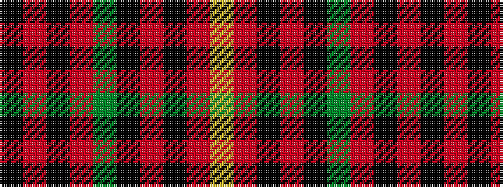

KRKRGKRKRY

It is a 10 stripe tartan.

<figure class="pat-woven">

<figcaption>idealised sample</figcaption>
</figure>

## Colour Sequence



## Tartans with this colour sequence

| Tartans |
|---------------|
| [Dinwiddie](/variants/s10/ly7o2k2o41k12g22o6k2r4k2~x2/)|
||
| [Dinwiddie Clan Tartan](/variants/s10/ly4o2k2o42k13g25o6k2r4k2~x2/)|
||
