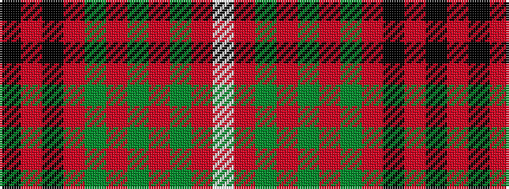

KRKRGRGRGRW

It is a 11 stripe tartan.

<figure class="pat-woven">

<figcaption>idealised sample</figcaption>
</figure>

## Colour Sequence



## Tartans with this colour sequence

| Tartans |
|---------------|
| [North Berwick Pipe Band (Dancing)](/setts/s11/k10r2k10r10dg2r2dg2r2dg10r1w2~x2/)|
||
