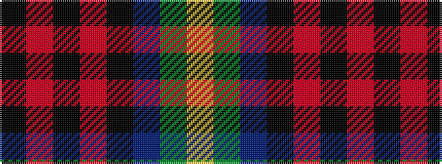

KRKRKBGY

It is a 8 stripe tartan.

<figure class="pat-woven">

<figcaption>idealised sample</figcaption>
</figure>

## Colour Sequence



## Tartans with this colour sequence

| Tartans |
|---------------|
| [Craigmoor (Fashion)](/setts/s8/k1r7k2r1k2do1g3ly1~x4/)|
||
