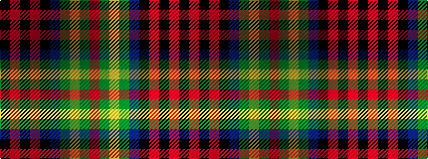

KRKRKBGYGR

It is a 10 stripe tartan.

<figure class="pat-woven">

<figcaption>idealised sample</figcaption>
</figure>

## Colour Sequence



## Tartans with this colour sequence

| Tartans |
|---------------|
| [Connolly Hunting (Name)](/variants/s10/k6r2k2r2k6db7g20ly2g3r2~x2/)|
||
