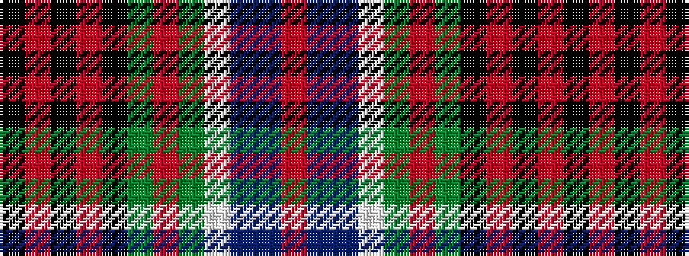

KRKRKGRGWBBR

It is a 12 stripe tartan.

<figure class="pat-woven">

<figcaption>idealised sample</figcaption>
</figure>

## Colour Sequence



## Tartans with this colour sequence

| Tartans |
|---------------|
| [Princess Diana](/setts/s12/k14r2k2r2k2g18r2g18lb1db12t1r8~x2/)|
||
