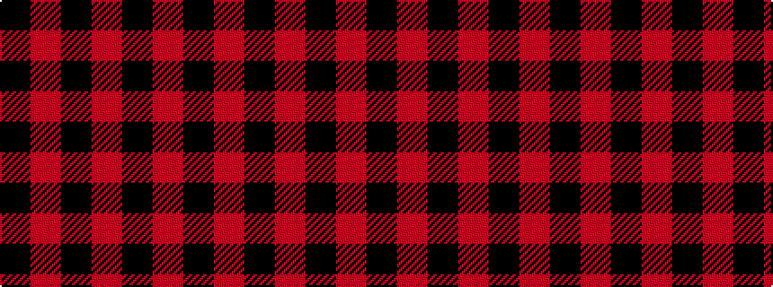

KRKRKR

It is a 6 stripe tartan.

<figure class="pat-woven">

<figcaption>idealised sample</figcaption>
</figure>

## Colour Sequence



## Tartans with this colour sequence

This pattern is a design lineage: every tartan below shares one colour order, whatever its owner —
near-identical designs are grouped, the largest lineage first (#112: the pattern is a tartan's
second parent, beside its family or clan).

<table class="sett-table">
<tbody>
<tr><td><a href="/variants/s6/k6r1k24r28k1r4~x2/">Aragon (Erskine)</a></td></tr>
<tr><td class="sett-swatch"></td></tr>
<tr><td><a href="/variants/s6/k2r12k2r12k33r2~x2/">Cameron Black &amp; Red (Dress)</a></td></tr>
<tr><td class="sett-swatch"></td></tr>
<tr><td><a href="/variants/s6/k1r4k1r4k13r1~x4/">Cameron, Black &amp; Red (dress)</a></td></tr>
<tr><td class="sett-swatch"></td></tr>
<tr><td><a href="/variants/s6/k31r4k47r47k4r31~x2/">Erskine (Paton)</a></td></tr>
<tr><td class="sett-swatch"></td></tr>
<tr><td><a href="/variants/s6/k6r3k28r28k3r6~x2/">Erskine, Black &amp; Red (Clan)</a></td></tr>
<tr><td class="sett-swatch"></td></tr>
<tr><td><a href="/variants/s4/k23r3k1r12~x4/">Ewing</a></td></tr>
<tr><td class="sett-swatch"></td></tr>
<tr><td><a href="/variants/s6/k3r1k16r16k1r3~x4/">The Mary Erskine</a></td></tr>
<tr><td class="sett-swatch"></td></tr>
<tr class="cluster-sep"><td></td></tr>
<tr><td><a href="/variants/s6/k16r16k19r5k6r2~x4~r1807016/">Henry, W. A. (Commemorative)</a></td></tr>
<tr><td class="sett-swatch"></td></tr>
</tbody>
</table>

