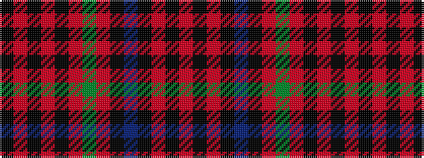

KRKRKRGRKBKRKR

It is a 14 stripe tartan.

<figure class="pat-woven">

<figcaption>idealised sample</figcaption>
</figure>

## Colour Sequence



## Tartans with this colour sequence

| Tartans |
|---------------|
| [Hebrides #11](/setts/s14/k3r2k17r3k17r3g3r3k17b3k4r1k17r2~x2/)|
||
