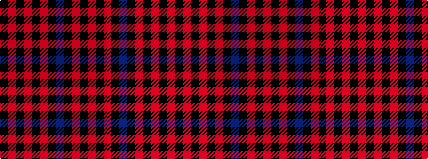

KRKRKRKBKRKR

It is a 12 stripe tartan.

<figure class="pat-woven">

<figcaption>idealised sample</figcaption>
</figure>

## Colour Sequence



## Tartans with this colour sequence

| Tartans |
|---------------|
| [Red Hatters United](/variants/s12/k4r2k2ri2k2r36k2dp12k2ri1k3r2~x2/)|
||
