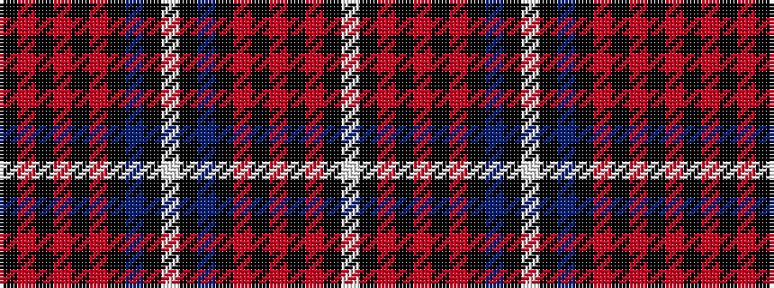

KRKRKRKBKWKBKRKRKRKW

It is a 20 stripe tartan.

<figure class="pat-woven">

<figcaption>idealised sample</figcaption>
</figure>

## Colour Sequence



## Tartans with this colour sequence

| Tartans |
|---------------|
| [Gwyn of Wales](/setts/s20/k3r30k2r4k2r30k3db30k35w2k35db30k3r30k2r4k2r30k3w2/)|
||
