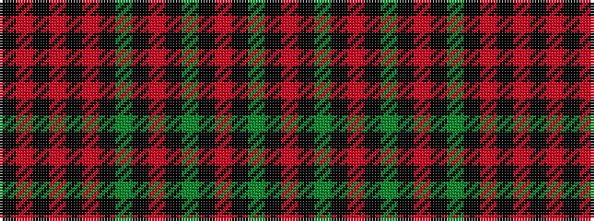

KRKRKRKGKRKGKRKGKR

It is a 18 stripe tartan.

<figure class="pat-woven">

<figcaption>idealised sample</figcaption>
</figure>

## Colour Sequence



## Tartans with this colour sequence

| Tartans |
|---------------|
| [Bumbee #2 (Fashion)](/setts/s18/r10k1dy1k1r1k1dy10k1r1k1dy1k1r10k1r1k1r1k1~x4/)|
||
