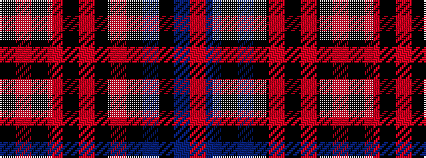

KRKRKRKRKBKBR

It is a 13 stripe tartan.

<figure class="pat-woven">

<figcaption>idealised sample</figcaption>
</figure>

## Colour Sequence



## Tartans with this colour sequence

| Tartans |
|---------------|
| [Fowler](/variants/s13/k4o4k1o4k1o8k1o4k8db2k1db14r2~x2/)|
||
