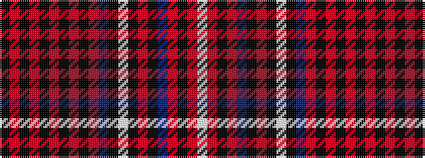

KRKRKRKRKRBKWKRKBRKRW

It is a 21 stripe tartan.

<figure class="pat-woven">

<figcaption>idealised sample</figcaption>
</figure>

## Colour Sequence



## Tartans with this colour sequence

| Tartans |
|---------------|
| [Hood (Artefact)](/setts/s21/k8o2k8o2k8o2k8o2k8o46db8k11w2k2o2k2db8o8k2o2w2~x2/)|
||
