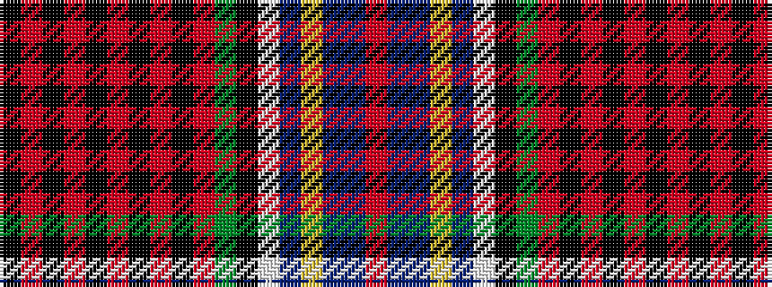

KRKRKRKRKRGKWBYBBR

It is a 18 stripe tartan.

<figure class="pat-woven">

<figcaption>idealised sample</figcaption>
</figure>

## Colour Sequence



## Tartans with this colour sequence

| Tartans |
|---------------|
| [MacRae, of Ardentoul](/variants/s18/r11t3db18ly1db2w1k1g18r3k1r2k3r2k1r40k1r2k3~x2/)|
||
