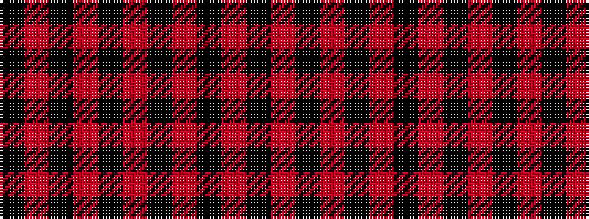

KRKRKRKRKRK

It is a 11 stripe tartan.

<figure class="pat-woven">

<figcaption>idealised sample</figcaption>
</figure>

## Colour Sequence



## Tartans with this colour sequence

| Tartans |
|---------------|
| [Gwyn (Welsh Name)](/setts/s11/k2r35k30r3k30r2k4r2k30r3k2/)|
||
