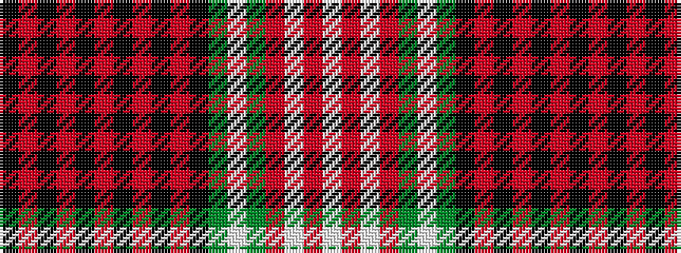

KRKRKRKRKRKGWGRWRW

It is a 18 stripe tartan.

<figure class="pat-woven">

<figcaption>idealised sample</figcaption>
</figure>

## Colour Sequence



## Tartans with this colour sequence

| Tartans |
|---------------|
| [Bahrain, Royal](/setts/s18/k16r1k2r3k1r9k1r3k2r1k6dg3lb3dg5r28w3r3w3~x2/)|
||
