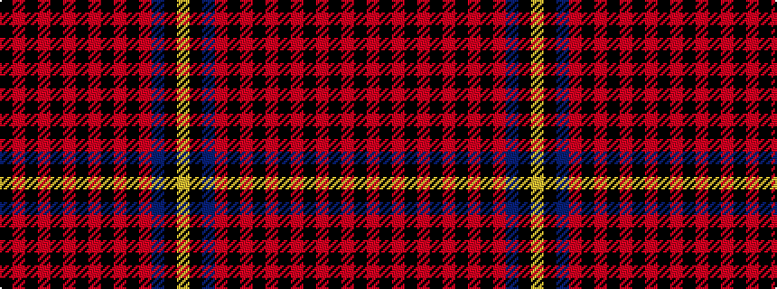

KRKRKRKRKRKRBKY

It is a 15 stripe tartan.

<figure class="pat-woven">

<figcaption>idealised sample</figcaption>
</figure>

## Colour Sequence



## Tartans with this colour sequence

| Tartans |
|---------------|
| [Citymoves (2012) (Corporate)](/variants/s15/k12r1k2r2k2r3k2r4k2r2k2r1db36k16ly3~x2/)|
||
