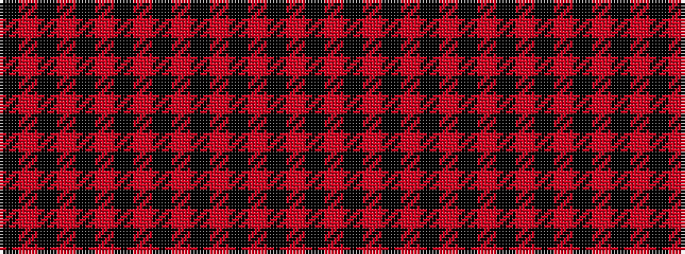

KRKRKRKRKRKRKRKR

It is a 16 stripe tartan.

<figure class="pat-woven">

<figcaption>idealised sample</figcaption>
</figure>

## Colour Sequence



## Tartans with this colour sequence

| Tartans |
|---------------|
| [Murray of Ochtertyre](/setts/s16/k8r1k1r1k1r10k10r1k1~x4/)|
||
