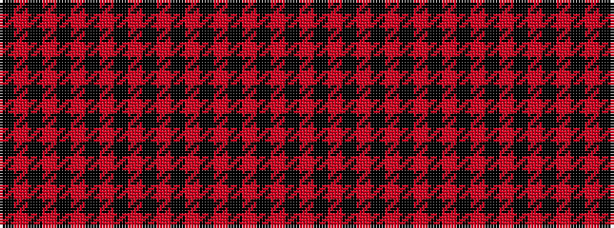

KRKRKRKRKRKRKRKRKRKRK

It is a 21 stripe tartan.

<figure class="pat-woven">

<figcaption>idealised sample</figcaption>
</figure>

## Colour Sequence



## Tartans with this colour sequence

| Tartans |
|---------------|
| [MacLeod](/setts/s21/k3r2k1r6k24r6k1r1k3r2k1r32k24r6k6r32k24r16k6r4k2~x2/)|
||
