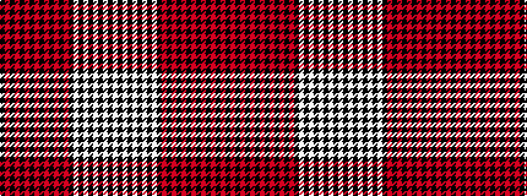

KRKRKRKRKRKRKRKWKWKWKWKW

It is a 24 stripe tartan.

<figure class="pat-woven">

<figcaption>idealised sample</figcaption>
</figure>

## Colour Sequence



## Tartans with this colour sequence

| Tartans |
|---------------|
| [Angus (Paton)](/variants/s24/k27r13k27r2k2r2k2r2k2r2k2r2k2r2k2w6k3w6k3w6k3w6k3w6~x2/)|
||
| [Angus, Red (Fashion)](/variants/s24/k27r13k27r2k2r2k2r2k2r2k2r2k2r2k2lb6k3lb6k3lb6k3lb6k3lb6~x2/)|
||
