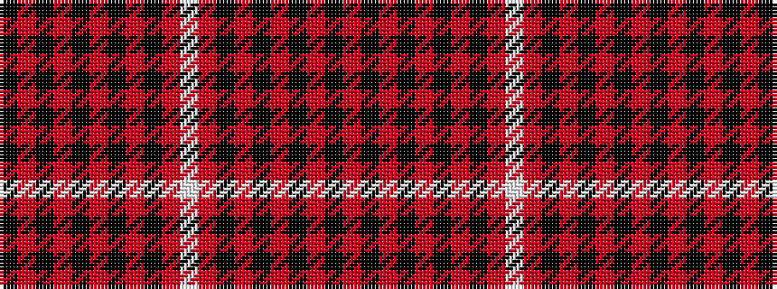

KRKRKRKRKRWRKRKRKRKR

It is a 20 stripe tartan.

<figure class="pat-woven">

<figcaption>idealised sample</figcaption>
</figure>

## Colour Sequence



## Tartans with this colour sequence

| Tartans |
|---------------|
| [Hebrides #12](/variants/s20/k2r2k12r2k2r18k2r2k12r2w1~x2/)|
||
