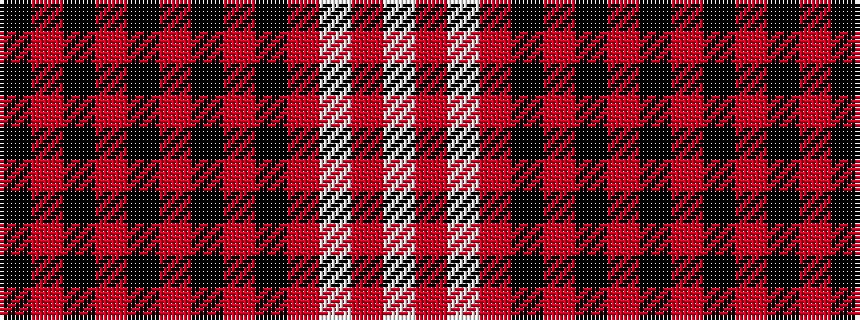

KRKRKRKRKRWRW

It is a 13 stripe tartan.

<figure class="pat-woven">

<figcaption>idealised sample</figcaption>
</figure>

## Colour Sequence



## Tartans with this colour sequence

| Tartans |
|---------------|
| [Jupiter Shop Channel Co Ltd](/setts/s13/k6m1k1m1k1m5k2m5k4m2w1m40w1~x2/)|
||
| [Jupiter Shop Channel Co., Ltd (Corp)](/setts/s13/k6r1k1r1k1r5k2r5k4r2w1r40w1~x2/)|
||
