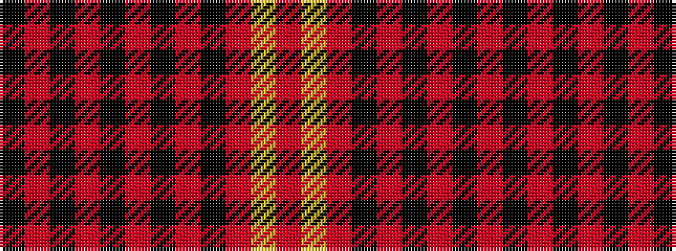

KRKRKRKRKRYR

It is a 12 stripe tartan.

<figure class="pat-woven">

<figcaption>idealised sample</figcaption>
</figure>

## Colour Sequence



## Tartans with this colour sequence

| Tartans |
|---------------|
| [Malt, The](/setts/s12/k20r2k4r2k19ri17k10ri10k6ri5ly2ri2~x2/)|
||
| [Malt, The (Corporate)](/setts/s12/k20r2k4r2k19o17k10o10k6o5ly2o2~x2/)|
||
