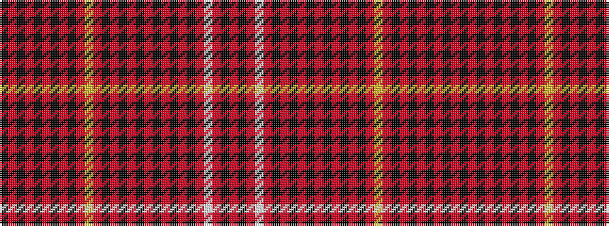

KRKRKRKRKRYRKRKRKRKRKRKRWRKR

It is a 28 stripe tartan.

<figure class="pat-woven">

<figcaption>idealised sample</figcaption>
</figure>

## Colour Sequence



## Tartans with this colour sequence

| Tartans |
|---------------|
| [Killin](/variants/s28/k26r2k6r2k26r4k4r4k4r18lo2r18k4r4k4r4k26r2k6r2k26r9k4r20w2r20k4r9~x2/)|
||
