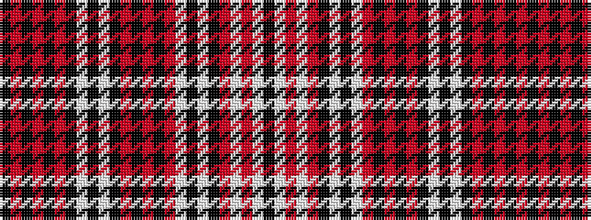

KRKRKRKWKWKRKRKRWKWKRWRWK

It is a 25 stripe tartan.

<figure class="pat-woven">

<figcaption>idealised sample</figcaption>
</figure>

## Colour Sequence



## Tartans with this colour sequence

| Tartans |
|---------------|
| [Amstartan](/setts/s25/k6r5k5r5k5r5k12w2k2w2k12r5k38r21k6r21w2k12w2k12r3w2r3w2k6/)|
||
