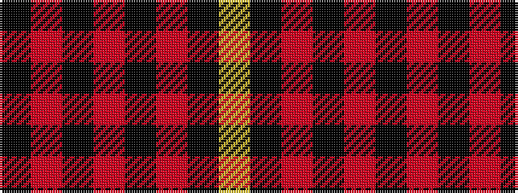

KRKRKRKY

It is a 8 stripe tartan.

<figure class="pat-woven">

<figcaption>idealised sample</figcaption>
</figure>

## Colour Sequence



## Tartans with this colour sequence

| Tartans |
|---------------|
| [Oilmens (Corporate)](/setts/s8/ly4k1r30k15r24k2r4k1~x4/)|
||
| [Royal Army PTC Assoc. (Military)](/setts/s8/k59r3k6r3k8r15k2ly3~x2/)|
||
| [Royal Army Physical Training Corps Association (Scotland)](/setts/s8/k94r3k6r3k8r15k2ly3~x2/)|
||
