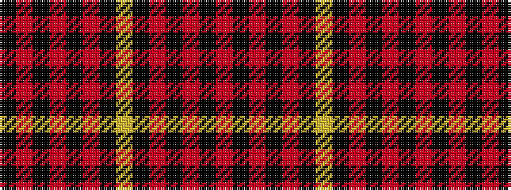

KRKRKRKYKRKRKR

It is a 14 stripe tartan.

<figure class="pat-woven">

<figcaption>idealised sample</figcaption>
</figure>

## Colour Sequence



## Tartans with this colour sequence

| Tartans |
|---------------|
| [Oilmens](/setts/s14/r4k2r24k15r30k1ly4k1r30k15r24k2r4k1~x4/)|
||
