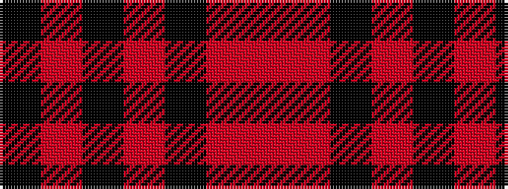

KRKRKRR

It is a 7 stripe tartan.

<figure class="pat-woven">

<figcaption>idealised sample</figcaption>
</figure>

## Colour Sequence



## Tartans with this colour sequence

| Tartans |
|---------------|
| [Moffat (1984)](/variants/s7/k39o3k3o3k14o28r3~x2/)|
||
