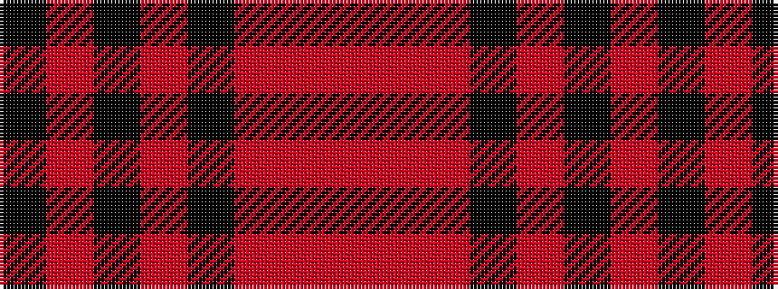

KRKRKRRR

It is a 8 stripe tartan.

<figure class="pat-woven">

<figcaption>idealised sample</figcaption>
</figure>

## Colour Sequence



## Tartans with this colour sequence

| Tartans |
|---------------|
| [Virgin](/setts/s8/r51o2r6k10r2k4o3k3~x2/)|
||
