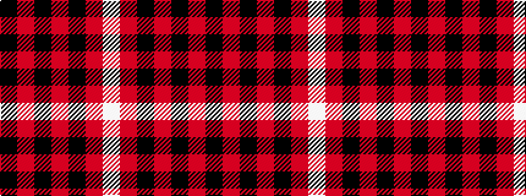

KRKRKRW

It is a 7 stripe tartan.

<figure class="pat-woven">

<figcaption>idealised sample</figcaption>
</figure>

## Colour Sequence



## Tartans with this colour sequence

| Tartans |
|---------------|
| [Cunningham](/variants/s7/k3r1k30r28k1r1w3~x2/)|
||
| [Cunningham #2](/variants/s7/k3r2k30r28k2r2w3~x2/)|
||
| [Cunningham D](/variants/s7/k3r1k30r28k1r1lb3~x2/)|
||
| [Menzies of Culdares](/variants/s7/k4r2k22r22k3r4lb2~x2/)|
||
