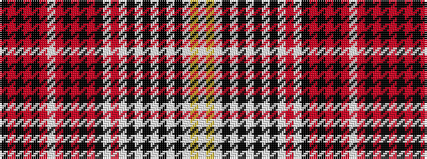

KRKRKRWRKRKRKWRWKWKWKWKWYW

It is a 26 stripe tartan.

<figure class="pat-woven">

<figcaption>idealised sample</figcaption>
</figure>

## Colour Sequence



## Tartans with this colour sequence

| Tartans |
|---------------|
| [Casey (Dress) Fashion Tartan](/variants/s26/w14ly2w14k4w4k8w3k8w4k4w14r2w14k3r1k1r1k1r8w2r8k1r1k1r1k3~x2/)|
||
| [Casey Dress (Estimated threadcount)](/variants/s26/w14ly2w14k4w4k8w3k8w4k4w14r2w14k4r1k1r1k1r8w2r8k1r1k1r1k4~x2/)|
||
