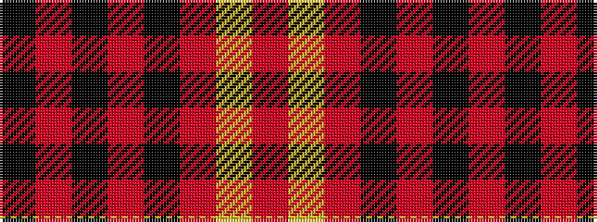

KRKRKRYR

It is a 8 stripe tartan.

<figure class="pat-woven">

<figcaption>idealised sample</figcaption>
</figure>

## Colour Sequence



## Tartans with this colour sequence

| Tartans |
|---------------|
| [West Point](/variants/s8/k13o1k1o1k4o10ly1o1~x6/)|
||
| [West Point Military Academy (Mil.)](/variants/s8/k10o1k2o1k4o10ly1o2~x4/)|
||
