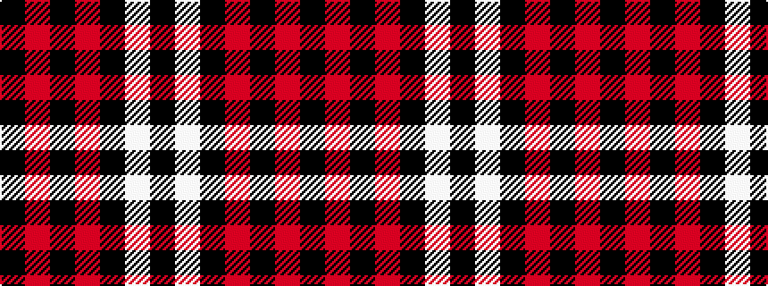

KRKRKWK

It is a 7 stripe tartan.

<figure class="pat-woven">

<figcaption>idealised sample</figcaption>
</figure>

## Colour Sequence



## Tartans with this colour sequence

| Tartans |
|---------------|
| [Salt Lake County](/variants/s7/k4m40k1m3k1w3k4~x2/)|
||
| [Salt Lake County (District)](/variants/s7/k4r40k1r3k1w3k4~x2/)|
||
