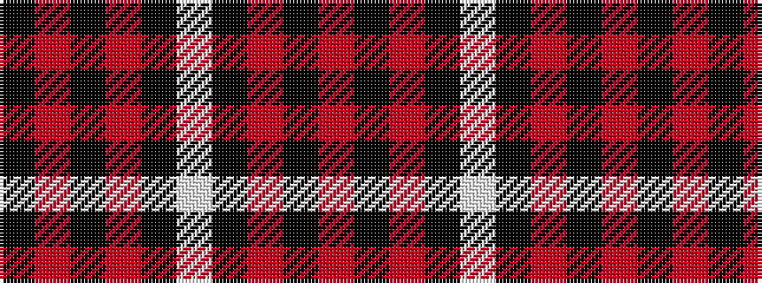

KRKRKWKRKR

It is a 10 stripe tartan.

<figure class="pat-woven">

<figcaption>idealised sample</figcaption>
</figure>

## Colour Sequence



## Tartans with this colour sequence

| Tartans |
|---------------|
| [King Robert the Bruce Memorial (Com](/variants/s10/r8k79o4k4lb4k6o22k6r16k6/)|
||
