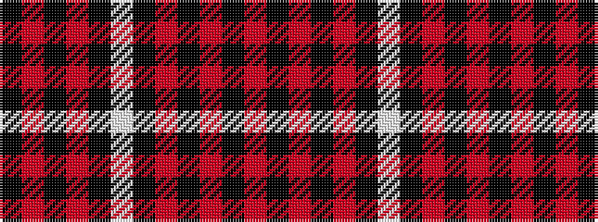

KRKRKWKRKRKR

It is a 12 stripe tartan.

<figure class="pat-woven">

<figcaption>idealised sample</figcaption>
</figure>

## Colour Sequence



## Tartans with this colour sequence

| Tartans |
|---------------|
| [University of Georgia (Corporate)](/setts/s12/k6r31k1r6k1w2k1r4k6r2k31r6~x2/)|
||
