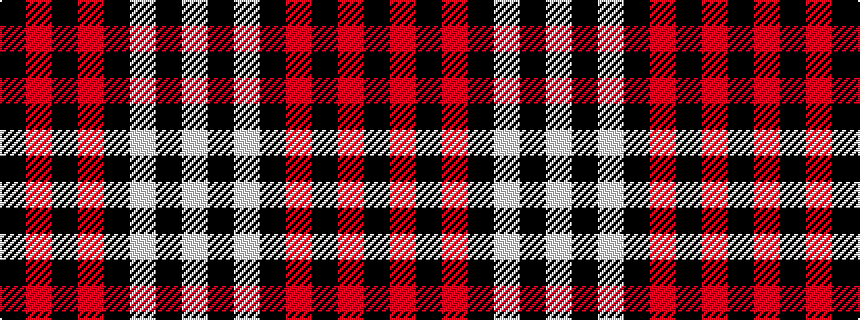

KRKRKWKW

It is a 8 stripe tartan.

<figure class="pat-woven">

<figcaption>idealised sample</figcaption>
</figure>

## Colour Sequence



## Tartans with this colour sequence

| Tartans |
|---------------|
| [University of Nebraska Alumni Association](/variants/s8/w6k2w2k31r41k2r2k4~x2/)|
||
