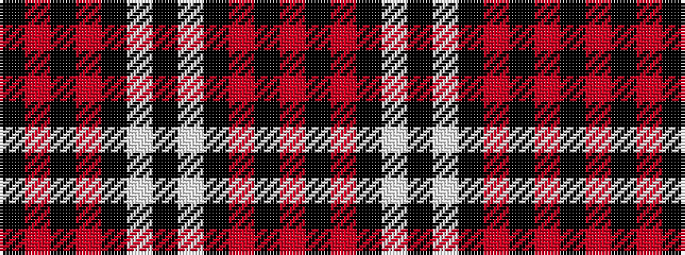

KRKRKWKWKRKR

It is a 12 stripe tartan.

<figure class="pat-woven">

<figcaption>idealised sample</figcaption>
</figure>

## Colour Sequence



## Tartans with this colour sequence

| Tartans |
|---------------|
| [Salt Lake County](/setts/s12/r40k1r3k1w3k4w3k1r3k1r40k4~x2/)|
||
