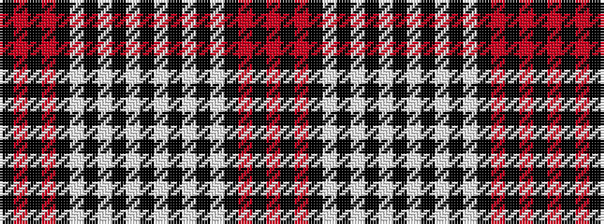

KRKRKWKWKWKWKWKWKRKR

It is a 20 stripe tartan.

<figure class="pat-woven">

<figcaption>idealised sample</figcaption>
</figure>

## Colour Sequence



## Tartans with this colour sequence

| Tartans |
|---------------|
| [Stewart/Stuart Royal (B,W. & Grey)](/variants/s20/o11k16o4k4w4k4w19k14w4k14w4k14w19k4w4k4o4k16o11k8/)|
||
