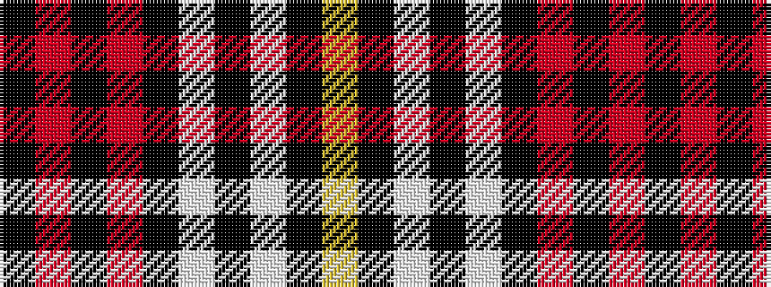

KRKRKWKWKY

It is a 10 stripe tartan.

<figure class="pat-woven">

<figcaption>idealised sample</figcaption>
</figure>

## Colour Sequence



## Tartans with this colour sequence

| Tartans |
|---------------|
| [Little Dress](/setts/s10/k4r4k4r4k4w8k2w8k8lo1~x4/)|
||
