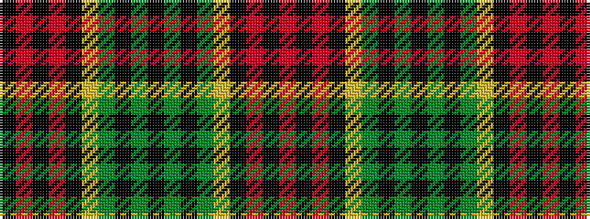

KRKRKYGKGKGKGYKRKR

It is a 18 stripe tartan.

<figure class="pat-woven">

<figcaption>idealised sample</figcaption>
</figure>

## Colour Sequence



## Tartans with this colour sequence

| Tartans |
|---------------|
| [Sackett](/variants/s18/k8dg8k1dg8lr1k8o8k1o8k8~x4/)|
||
