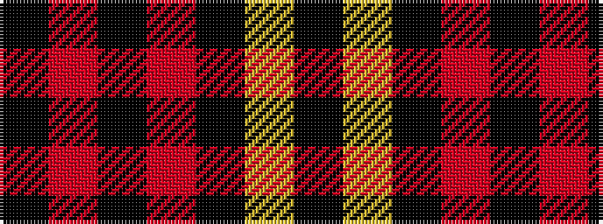

KRKRKYK

It is a 7 stripe tartan.

<figure class="pat-woven">

<figcaption>idealised sample</figcaption>
</figure>

## Colour Sequence



## Tartans with this colour sequence

| Tartans |
|---------------|
| [DDB Canada (Fashion)](/variants/s7/k1o2k7o11k18ly2k1~x2/)|
||
