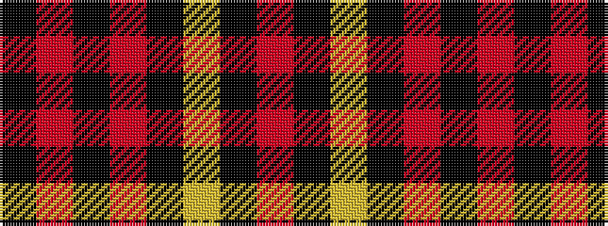

KRKRKYKR

It is a 8 stripe tartan.

<figure class="pat-woven">

<figcaption>idealised sample</figcaption>
</figure>

## Colour Sequence



## Tartans with this colour sequence

| Tartans |
|---------------|
| [Barkwell (Personal)](/setts/s8/r20k1ly3k1r60k30r48k4~x2/)|
||
