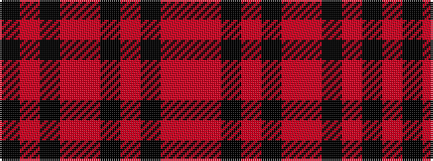

KRKRRKRKRR

It is a 10 stripe tartan.

<figure class="pat-woven">

<figcaption>idealised sample</figcaption>
</figure>

## Colour Sequence



## Tartans with this colour sequence

| Tartans |
|---------------|
| [Harry/Parry](/variants/s10/k6o3k3o15r7k7r5k17r46o4/)|
||
