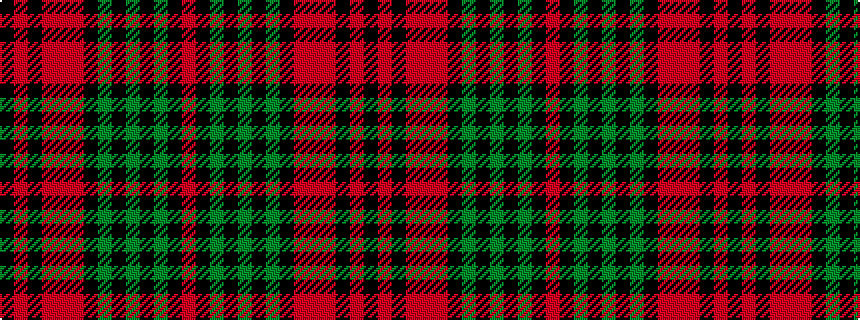

KRKRRRKGKGKGKR

It is a 14 stripe tartan.

<figure class="pat-woven">

<figcaption>idealised sample</figcaption>
</figure>

## Colour Sequence



## Tartans with this colour sequence

| Tartans |
|---------------|
| [Anderson 10](/variants/s14/k3ri7k4o7r3o7k4g3k3g19k2g2k2r3~x2/)|
||
