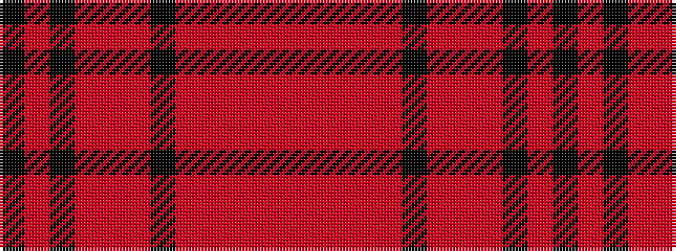

KRKRRRKRRRRR

It is a 12 stripe tartan.

<figure class="pat-woven">

<figcaption>idealised sample</figcaption>
</figure>

## Colour Sequence



## Tartans with this colour sequence

| Tartans |
|---------------|
| [Black Forest](/variants/s12/k20oi4k20o2oi2o7k2oi2o2oi7o2oi2~x4/)|
||
