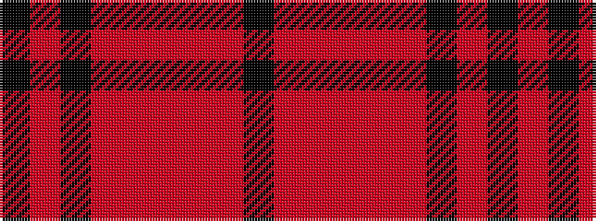

KRKRRRRRK

It is a 9 stripe tartan.

<figure class="pat-woven">

<figcaption>idealised sample</figcaption>
</figure>

## Colour Sequence



## Tartans with this colour sequence

| Tartans |
|---------------|
| [Breckon (Name)](/setts/s9/k3o1k14r14o1r1o1r1k2~x4/)|
||
