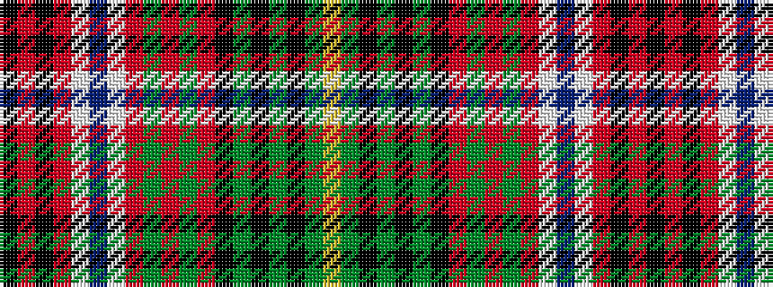

KRKRWBWRGRGRKGKGKGY

It is a 19 stripe tartan.

<figure class="pat-woven">

<figcaption>idealised sample</figcaption>
</figure>

## Colour Sequence



## Tartans with this colour sequence

| Tartans |
|---------------|
| [Princess Beatrice, dress](/variants/s19/k4r1k1r2w24db2w3r8g2r2g2r2k8g2k2g2k2g8ly2~x2/)|
||
