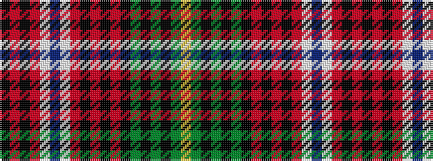

KRKRWBWRKRKRKGKGKGY

It is a 19 stripe tartan.

<figure class="pat-woven">

<figcaption>idealised sample</figcaption>
</figure>

## Colour Sequence



## Tartans with this colour sequence

| Tartans |
|---------------|
| [Princess Beatrice Dress (1880)](/setts/s19/k3r1k2r2w20db3w3r8k2r2k2r2k8g2k2g2k2g8ly2~x2/)|
||
