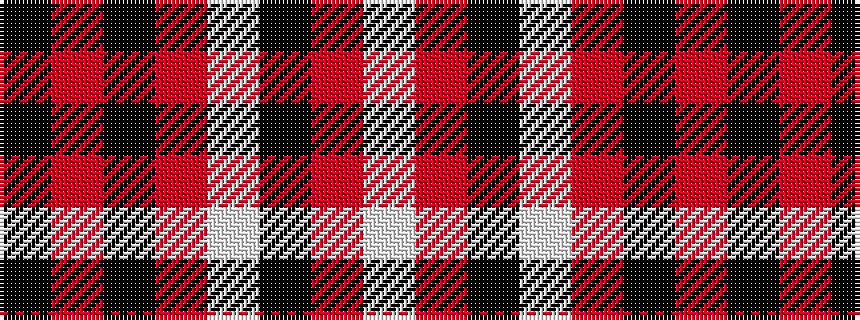

KRKRWKRW

It is a 8 stripe tartan.

<figure class="pat-woven">

<figcaption>idealised sample</figcaption>
</figure>

## Colour Sequence



## Tartans with this colour sequence

| Tartans |
|---------------|
| [Lougheed](/variants/s8/lb3r3k4lb2r18k1r2k2~x4/)|
||
